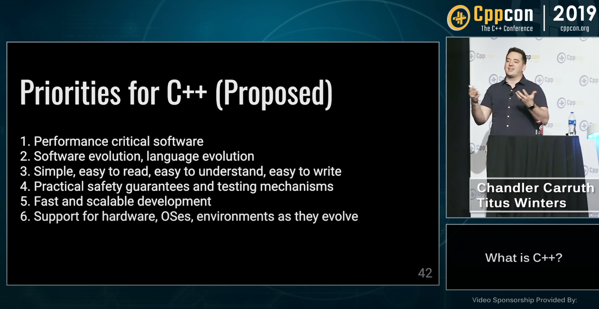

## Let's start designing!

NOTES:
Now that we have articulated the problem, and we've convinced our coworkers it's an important problem to solve, we might be tempted to start thinking about solutions. But we're not ready for that yet.

@@@

##  Let's start designing!
### What are our design priorities?

NOTES:

* The thing is, no solution is perfect, and in our design process we're going to encounter multiple competing designs.
* We need a somewhat systematic way to judge our design.
* We need a mechanism to help us determine what is critical and where we can compromise.
* The good news is you usually only have to do this once. Design goals can often be carried over from project to project.

---

* Chandler Carruth and Titus Winters spoke in 2019 about their design priorities for C++.
* There's a lot in here that generally matches my own design sensibilities so I think it's a good place for us to start.
* I want to focus on just four of these today.

@@@

##  Let's start designing!
### What are our design priorities?

1. Evolution
1. Understandability
1. Safety & Testing
1. Development Speed

NOTES:

First, I care about evolution, both for the library author and the library user.
* Library authors should be free to make improvements to their library.
* But more importantly, I care about evolution for the library user. User code is going to change over time and they shouldn't be locked into an all-or-nothing situation. A small change in their code shouldn't mean they have to give up on the entire library.

Second, I care about understandability.
* All else equal, I want libraries that feel familiar to users that have only a basic knowledge of C++

Next, I care about Safety & Testing
* I often think of this in terms of trying to dig a "pit of success." We should strive to avoid dangerous gotchas.

And lastly, I care about development speed.
* This has to be on the list because it was literally one of the reasons we're solving this boilerplate problem, but it's also something that I just generally think is important.

There are three things that I think are worth calling out here.

1. **Performance** is not on this list. It's not that I don't care, I do, but with optimizations on there's no meaningful runtime overhead for any of the solutions we're going to look at today, and the compile-time overhead has been negligible in practice, so it's just not relevant today.
1. Notice that this **list is ordered**. That's because evolution is more important to me than development speed. If faced with a tradeoff where I could make something easier for users but it would lock them in to a smaller set of usage patterns, I will heavily lean away from doing that.
1. Lastly, if you were listening carefully, you will notice that I used a lot of **"I" statements. I don't claim that these should be everyone's priorities**, and I'm not even going to defend why I they're mine. If you disagree, that's great let's chat after the talk. But for this talk I'm going to take these priorities axiomatically. And that's because my goal is not to convince you that any particular set of design priorities are correct, but rather to show you the way I think about
   design. And that's entirely independent of any particular set of priorities.
