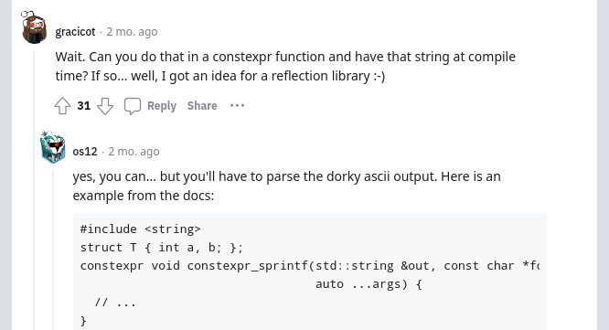

## Development Speed

> "Can you make &nbsp;`Extend`&nbsp; print its field names?"
<!-- .element class="blockquote1" -->

@@@

## Development Speed

```cc[]
template <typename T>
struct PrintingExtension {
  friend std::ostream& operator<<(std::ostream& os, const T& value) {
    std::string_view separator = "{ ";

    std::apply([&](auto&... fields) {
      ((os << std::exchange(separator, ", ") << fields), ...);
    }, PrintingExtension::Unpack(value));

    return os << " }";
  }
};
```
<!-- .element style="font-size:14pt;" -->

NOTES:

Our original implementation looked like this, but it was definitely lacking.
With TUPLE_DEFINE_STRUCT, people had access to the field names.

@@@

## A wild zygoloid appeared!




<!--<a href="https://www.reddit.com/r/cpp/comments/100x37a/clang15_builtin_dump_struct_got_a_much_needed/">Reddit</a>-->

NOTES:

TODO: Show the first bit, then the top comment then the response.

@@@

## Development Speed

```cc[]
int PrintfHijack(ParsingState& state,
                 std::span<std::string_view> fields,
                 const char *format, ...) {
  std::va_list va;
  va_start(va, format);
  ...
  fields[state.index++] = va_arg(va, const char*);
  ...
}
```

@@@

```cc[]
template <size_t FieldCount>
struct FieldNameInfo {
  std::array<std::string_view, FieldCount> field_names;
  bool jitter;
  bool success;
};
```

@@@

```cc[]
FieldNameInfo<kFieldCount> field_name_info = [&] {
  std::array<std::string_view, kFieldCount> field_names;
  ParsingState state;
  __builtin_dump_struct(std::addressof(value),
                        PrintfHijack
                        state,
                        field_names);
  return FieldNameInfo{
    .field_names = field_names,
    .jitter = reinterpret_cast<uintptr_t>(&field_name_info) % 13 > 6,
    .success = (state.index = kFieldCount),
  }
}();
```

@@@

NOTES:

Why jitter:
Want to prevent Hyrum's law dependency on any specific field names for several
reasons.
1. Users might want to change them. Normally you would just change it and fix
   compilation errors, but with field names at runtime, you'll have behavior
   changes that might not be compilation errors.
1. If you're using this with private fields, we're still printing them! This
   sort of punches a whole in the encapsulation and we want to be careful there.
1. Portability. Nothing like this on compilers other than Clang.
