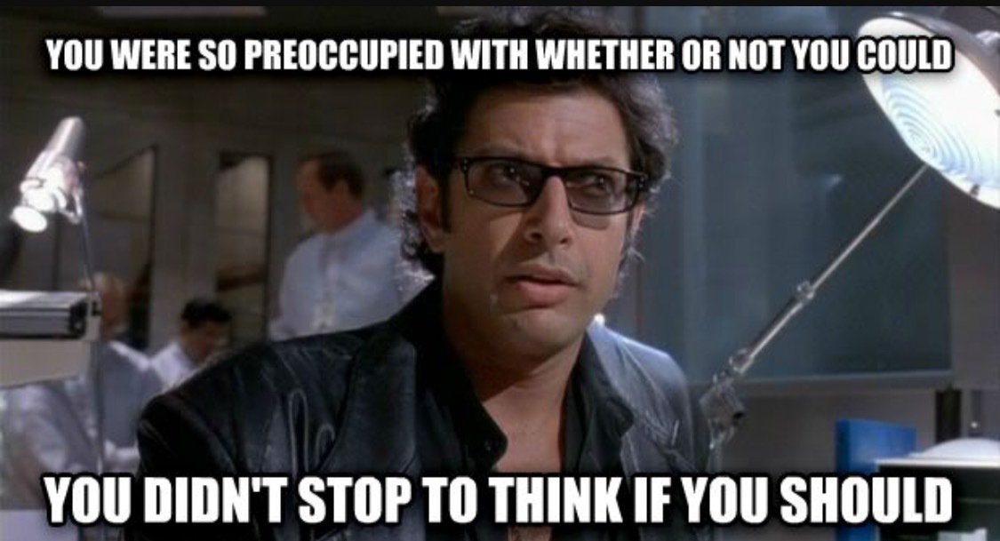
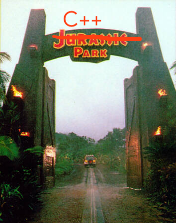

## Follow along!

[https://asoffer.github.io/reflect-this-presentation/cppnow-2023](https://asoffer.github.io/reflect-this-presentation/cppnow-2023)

(link available on the conference schedule)

NOTES:

* Follow along.

PAUSE

* I submitted the title for this talk before I knew exactly how I wanted to format it. The title is accurate, but it also could have been...

@@@

## How to design dinosaurs
### ^
### not

NOTES:

... "How not to design dinosaurs."

This is a reference to Jurassic Park.

If you haven't seen Jurassic Park, I apologize; the memes sprinkled throughout this talk are probably not going to be meaningful to you.

But there's a famous line in which Jeff Goldblum's character says...

---

... "your scientists were so preoccupied with whether or not they could, they didn't stop to think if they should."

I don't know about you, but this is a pattern I fall into. I get excited by some new language feature and I think "what can I use this for?" when I should really be thinking about the problem I'm trying to solve, rather than the solution I'm trying to apply.

So when I refer to dinosaurs, I'm talking about libraries that are clever and interesting science experiments...

@@@

## How to design dinosaurs
### ^
### not

NOTES:

...but ultimately might end up being difficult or dangerous to use properly.

So this talk is two things. It's a talk about a mixin library we've designed, but I want to use that library as a case study, to go through a process that helps me make sure I'm not designing a dinosaur.

@@@

## How I think about design
### Talk outline

1. What problem are we solving, and why?
1. What are our priorities?
1. Evaluate the design space.
1. Implement it!
1. Iteratively improve upon our design.

NOTES:

* Talk structured in the same way I think about design.
* Problem: If you can't articulate what the problem is *and* why it's a problem, you'll never convince anyone it's worth solving. -- If you're familiar with mixins, you already understand this, but bear with me.
* Priorities: Important to state explicitly. Tradeoffs.
* Evaluate: Explore what others have done, both in C++ and other languages. Start to make some decisions.
* Implement: Only once you understand the problem space.
* Iterate: You'll get it wrong the first try.

@@@

## "I did it all myself!"
### ...said no one ever.

> Sam Benzaquen
<!-- .element class="name1" -->

> Neema Ebrahim-Zadeh
<!-- .element class="name2" -->

> Greg Falcon
<!-- .element class="name1" -->

> Daisy Hollman
<!-- .element class="name2" -->

> Richard Smith
<!-- .element class="name1" -->

> Zie Weaver
<!-- .element class="name2" -->

NOTES:

* I'd be remiss if you came away from the talk thinking this work was just mine. That couldn't be further from the truth.
* In reality this work is the culmination of tons of discussions and design and implementation work from many engineers.
* These are the people who have really contributed in a way that fundamentally changed the direction of the library we're going to talk about.
* There are many others who have contributed via bug fixes or implementation improvements.

* I want to call out Zie Weaver in particular. She has done a huge amount here and is responsible for the migration of an existing library to this one.
* She's speaking immediately after this about the migration. If you're interested in learning about what I believe is the most complex large scale refactoring effort ever attempted in C++, I'd encourage you to attend her talk.
