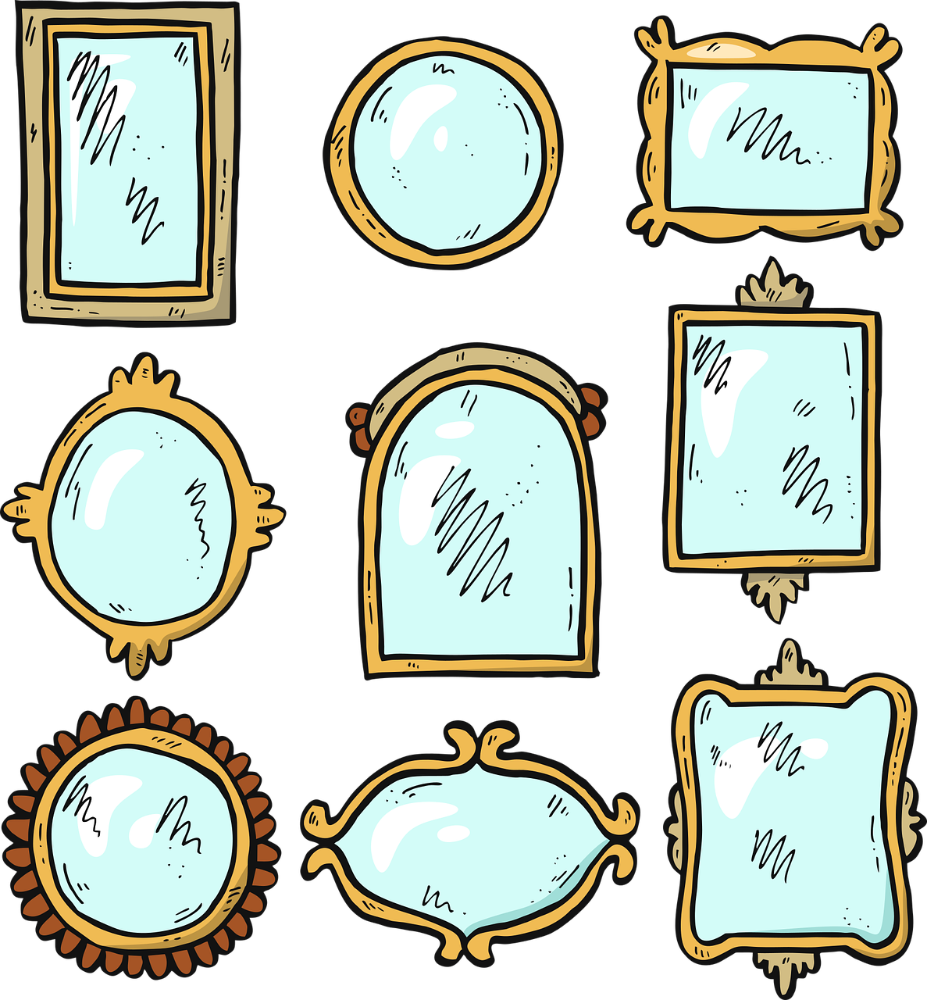

# Reflect `*this`!

 

### Design and Implementation of a Pragmatic Mixin Library with Static Reflection
<!-- .element style="font-size:32pt; width:80%" -->

NOTES:

* Who am I
* A talk about mixins.
* Focus on the problems they solve
* Frame this in terms of a specific set of design criteria

If I convince you of one thing, it's that the there is a ton of fertile ground
in the design space here. In the library space, as well as at the
language-level.

@@@ <!-- .element data-auto-animate -->

## The Plan

1. What problem are we solving, and why?
1. What are our priorities?
1. Evaluate several options.
1. Iteratively improve upon our design.

@@@ <!-- .element data-auto-animate -->

## The Plan

1. What problem are we solving, and why?
1. What are our priorities?
1. Evaluate several options.
1. Implementation
1. Iteratively improve upon our design.
