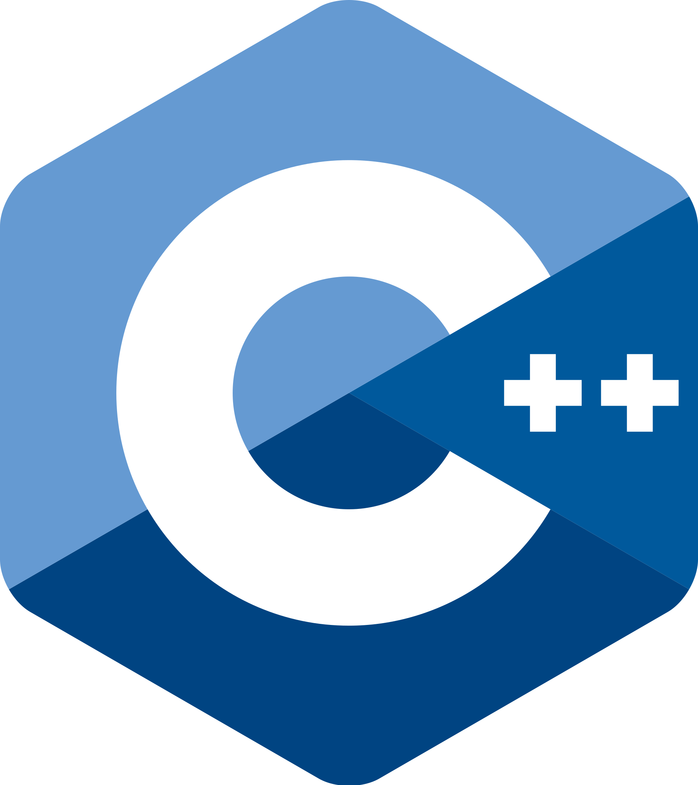

## What techniques can we leverage?

NOTES:

* Okay, so we know what problem we're solving and what our priorities are. Now we get to start exploring the design space.
* What techniques can we leverage?
* I by no means have an exhaustive list here, but I can think of 4.

@@@

## What techniques can we leverage?

* Code generators
* Macros
* Actual magic
* Mixins
<li style="visibility:hidden;">Language reflection support</li>

@@@

## What techniques can we leverage?

* <span class="crossed_out"><span class="wrong_content">Code generators</span></span>
* Macros
* Actual magic
* Mixins
<li style="visibility:hidden;">Language reflection support</li>

NOTES:
I'm going to rule out code generation immediately. Code generators are hostile to refactoring at scale, which is the primary tool I have for evolution. Because I care about evolution I have to throw this away as a possibility.

Beyond that, code generators solve the problem for code writers, but not readers. Either the generated code gets checked in, in which case you haven't helped readers at all, or the generated code is never checked in which case you have an understandability problem.

@@@

## What techniques can we leverage?

* <span class="crossed_out"><span class="wrong_content">Code generators</span></span>
* <span class="crossed_out"><span class="wrong_content">Macros</span></span>
* Actual magic
* Mixins
<li style="visibility:hidden;">Language reflection support</li>

NOTES:
Next, Macros are a just a form of code generator.

@@@

## What techniques can we leverage?

* <span class="crossed_out"><span class="wrong_content">Code generators</span></span>
* <span class="crossed_out"><span class="wrong_content">Macros</span></span>
* <span class="crossed_out"><span class="wrong_content">Actual magic</span></span>
* Mixins
<li style="visibility:hidden;">Language reflection support</li>

NOTES:

I'm still waiting on my acceptance letter to Hogwarts, so at lesat for the time being, actual magic isn't an option.

So that leaves us with just "mixins."

Well, that's a slight lie.

@@@

## What techniques can we leverage?

* <span class="crossed_out"><span class="wrong_content">Code generators</span></span>
* <span class="crossed_out"><span class="wrong_content">Macros</span></span>
* <span class="crossed_out"><span class="wrong_content">Actual magic</span></span>
* Mixins
* Language reflection support

NOTES:

There's one more tool I know of which is having honest-to-goodness language-level reflection support.

@@@

## What techniques can we leverage?

* <span class="crossed_out"><span class="wrong_content">Code generators</span></span>
* <span class="crossed_out"><span class="wrong_content">Macros</span></span>
* <span class="crossed_out"><span class="wrong_content">Actual magic</span></span>
* Mixins
* <span class="crossed_out"><span class="wrong_content">Language reflection support</span></span>

NOTES:

I hope we get that in C++26, but for today, wer'e stuck in this world.

Okay, so if we're going to be using mixins, we should understand what they are and what they look like, both in C++ and in other languages.

@@@

## <span style="vertical-align:top;">Mixins in</span>  <!-- .element style="height:64px; position:relative; top:-0.1em;" -->

```py[]
class Eq:
  def __eq__(self, other):
    return self.__dict__ == other.__dict__

class Person(Eq):
  def __init__(self):
    self.name = ""
    self.email = ""
```

NOTES:

So here's an example of a mixin in Python

Here we have a `Person` class, and an "equality" mixin. It's implemented as a base class, and you can see that it implements equality by comparing the underlying dictionaries.

Python being as dynamic as it is, the dictionary has access to the derived `Person` class, so there will be entries in the dictionary for "name" and "email."

@@@

## <span style="vertical-align:top;">Mixins in</span>  <!-- .element style="height:64px; position:relative; top:-0.3em;" -->

```javascript[]
let toStringMixin = {
  toString() {
    let s = "{\n";
    for (const property in this) {
      if (!(this[property] instanceof Function))
        s += `  ${property}: ${this[property]}\n`;
    }
    s += "}";
    return s;
  }
};

class Person {
  constructor(name, email) {
    this.name = name;
    this.email = email;
  }
}
Object.assign(Person.prototype, toStringMixin);
```
<!-- .element: style="font-size:12pt; width:57%;" -->

@@@ <!-- element: data-auto-animate -->

## <span style="vertical-align:top;">Mixins in</span>  <!-- .element style="height:64px; position:relative; top:-0.1em;" -->

```rust[]
#[derive(Eq)]
struct Person {
  name: String,
  email: String,
}
```
<!-- .element: style="width:30%;" -->

@@@

## <span style="vertical-align:top;">Mixins in</span>  <!-- .element style="height:64px; position:relative; top:-0.1em;" -->

```cc[]
struct Person {
  std::string name;
  std::string email;

  friend bool operator==(const Person&, const Person&) = default;
  friend bool operator!=(const Person&, const Person&) = default;
};
```
<!-- .element style="font-size:14pt;" -->

NOTES:

Only really have language support.
The goal is to fill in the gap until we can have actual language support.
